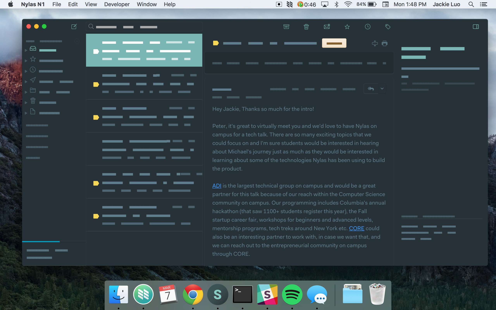

# Material for N1
A sunrise theme for N1, inspired by @equinusocio's [Material Theme](https://github.com/equinusocio/material-theme).

## Installation
1. Download the [Nylas N1](https://nylas.com/n1) email client!
2. Clone this repo.
3. On the N1 menu, select `N1 > Preferences > General > Select theme > Install new theme...`.
4. Find the directory for this plugin to install it. :tada:
